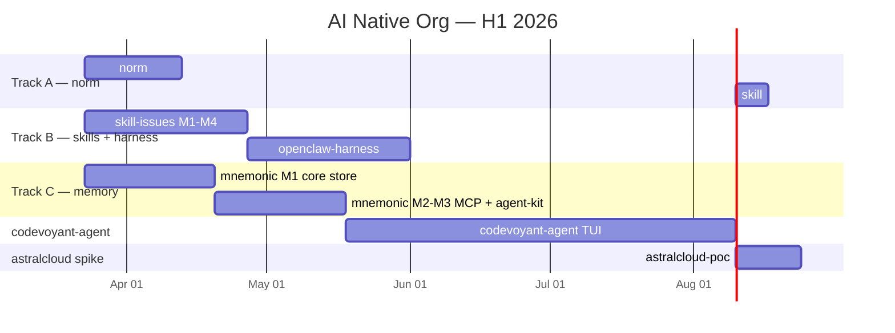

# AI Native Org — Initiative Plan

## Metadata

- **Linear Initiative**: https://linear.app/cloudvoyant/initiative/ai-native-org-f75ae59098b9
- **Horizon**: H1 2026 (2026-03-22 → 2026-09-22)
- **Roadmap source**: docs/product/roadmaps/260322-half-roadmap.md
- **Created**: 2026-03-22

## Objective

Build the infrastructure that enables fully autonomous, high-quality product development:
reliable coding skills, persistent memory, end-to-end workflow harness, and a TUI orchestrator.
These collectively enable Codevoyant agents to execute plan→implement→test→deploy cycles
without human intervention for well-scoped features.

---

## Projects

### Project 1: norm — NoSQL migration + schema manager

**Repo:** `@cloudvoyant/norm` (standalone, outside initiative but prerequisite)
**Linear project:** norm
**Timebox:** Wks 1-3 (parallel with skill-issues)
**Status:** WIP — `libs/norm` in readership `feature/READ-95-migrations` branch is substantially complete

#### Milestones

- [ ] M1 — Extract and package
  - [ ] Extract `libs/norm` from readership into `cloudvoyant/norm` standalone repo
  - [ ] Set up pnpm workspace + mise toolchain + vitest CI
  - [ ] Publish `@cloudvoyant/norm` to npm (public)
  - [ ] Migrate readership to import from `@cloudvoyant/norm`

#### Open Questions

- Does norm go in `cloudvoyant` org or personal? (affects npm scope)
- MongoDB adapter: deferred to backlog. The `NormAdapter<TDb>` generic interface already supports it — just needs an implementation. Track separately outside this initiative.

#### Future Work

- **MongoDB adapter** (backlog): Implement `MongoAdapter<MongoClient>` for MongoDB/Atlas support. Relevant if outgrowing Firestore. `NormAdapter<TDb>` is already generic — design is preserved.

---

### Project 2: skill-issues — Quality skills for automated workflows

**Linear project:** skill-issues
**Timebox:** Wks 1-5 (parallel; skill:norm blocked on Project 1 M1)
**Status:** Net-new

#### Open Questions

- **Skill consolidation**: Should em/pm/dev/spec skills be refactored into a single unified package with workflow files per skill (e.g., `@codevoyant/skills` with `workflows/pm-plan.md`, `workflows/em-review.md`)? Benefits: one `npx install`, simpler harness setup, single version pin. Trade-off: loses per-skill composability and portability across other agent platforms (OpenCode, Codex CLI). Worth a spike — if consolidation works, it directly unblocks cleaner harness installation. Could be M6 of this project if the quality skills land well.

#### Milestones

- [ ] M1 — TypeScript + pnpm monorepo skill
  - [ ] `skills/ts-monorepo/SKILL.md` — pnpm workspaces, vitest, mise, lib/app layout, barrel exports
  - [ ] Validation: skill:review passes, triggers correctly on "pnpm monorepo" / "ts library"
- [ ] M2 — SvelteKit skill
  - [ ] `skills/sveltekit/SKILL.md` — Svelte 5 runes, SvelteKit routing, Tailwind 4, form actions, load functions
  - [ ] Covers: component patterns, stores vs runes migration, SSR/CSR split, testing with Playwright
  - [ ] Validation: produces idiomatic Svelte 5 (not legacy options API)
- [ ] M3 — Platform engineering / mise skill
  - [ ] `skills/platform-eng/SKILL.md` — mise tasks, tool version pinning, Docker+supervisord, env management, secrets patterns
  - [ ] Migrate `nv-gcp-template` from justfile to mise (following the `nv-lib-template` → `nv-mise-template` migration pattern)
  - [ ] Covers: justfile vs mise tasks, devbox alternatives, CI/CD integration
- [ ] M4 — Terraform skill
  - [ ] `skills/terraform/SKILL.md` — GCP resources (Cloud Run, Firebase, IAM, networking), state management, module patterns
  - [ ] Covers: remote state, workspace strategy, plan/apply workflow
- [ ] M5 — norm skill (after Project 1 M1)
  - [ ] `skills/norm/SKILL.md` — schema design, migrations, Firestore patterns, MongoDB patterns, drift detection
  - [ ] Covers: `norm.config.ts`, collection typing with Zod, seeding, schema validate workflow

---

### Project 3: mnemonic — Persistent agent memory

**Linear project:** mnemonic
**Timebox:** Wks 1-8 (start parallel; blocking codevoyant-agent)
**Status:** Net-new

#### Design

SQLite + sqlite-vec embedded store. Zero server process, works over SSH, embeds in any Node/Deno process.
Long-term: open-source MCP server (matches Augment Context Engine positioning).
`mem:*` skills become thin wrappers over the mnemonic MCP tool surface.

#### Milestones

- [ ] M1 — Core store
  - [ ] SQLite schema: sessions, entries (type, content, embedding, tags, project, timestamp)
  - [ ] sqlite-vec integration: cosine similarity search over float32 embeddings
  - [ ] Embedding provider: local (model.gguf via llama.cpp) with OpenAI/Anthropic fallback
  - [ ] CRUD: store entry, semantic search, keyword search, delete, list by project
- [ ] M2 — MCP server
  - [ ] Expose store as MCP server (`mcp-server-mnemonic`)
  - [ ] Tools: `mem_store`, `mem_search`, `mem_recall`, `mem_forget`, `mem_list`
  - [ ] Claude Code integration: CLAUDE.md mcpServers entry; replaces `npx @codevoyant/agent-kit mem`
- [ ] M3 — Agent-kit migration
  - [ ] Update `mem:learn`, `mem:find`, `mem:list` skills to call mnemonic MCP tools
  - [ ] Automatic context loading: on session start, query mnemonic for active project context
  - [ ] Decision history: log every significant agent decision with rationale
- [ ] M4 — Cross-agent memory
  - [ ] Shared store path configurable (NFS or local replica)
  - [ ] Parallel agents in same project share memory namespace
  - [ ] Conflict-free: read-optimised; writes are append-only, no locking needed

#### Open Questions

- Local embedding model (fast but setup overhead) vs API embedding (easy but latency + cost)?
- sqlite-vec or hnswlib for vector index? (sqlite-vec has no native index — full scan at small scale is fine)
- **CLI vs MCP as primary interface**: coding agents need a clear integration path. MCP requires server config in `claude_desktop_config.json` / CLAUDE.md; CLI can be invoked directly from skills with `npx mnemonic`. Consider starting with a CLI surface (drop-in for `agent-kit mem`) and adding MCP as a second surface in M2. This also solves the "how do agents discover the tool" problem before MCP onboarding UX is solved.

---

### Project 4: openclaw-harness — E2E workflow runtime

**Linear project:** openclaw-harness
**Timebox:** Wks 4-9 (after skill-issues M1-M2 are meaningful)
**Status:** Partially working — `core-infra/apps/openclaw`

#### What exists

- Dockerized harness (supervisord, Claude Code via acpx ACP backend)
- OpenRouter routing via claude-code-router (Gemini 2.5 Flash default)
- Slack socket-mode integration (dispatch + monitor via DM)
- Gateway API on port 18789 (token-authenticated, local bind)
- Slack retry dedup patch (acks retry_num > 0 immediately)

#### What's needed

- [ ] M1 — Skill quality gates in harness
  - [ ] `spec-bg` + `dev-commit` work reliably inside the container environment
  - [ ] Quality gate pipeline: lint → typecheck → test before any commit is allowed
  - [ ] Harness surfaces pass/fail to Slack with structured output (not raw terminal dump)
- [ ] M2 — Dispatch API
  - [ ] Gateway API accepts structured workflow payloads: `{ plan, slug, flags }`
  - [ ] Returns session ID; webhook callback on completion
  - [ ] Auth hardened (rotate away from `changeme` default)
- [ ] M3 — Skill autonomy audit + custom agents (if needed)
  - [ ] Audit current dev/spec/em/pm skills for blocking user inputs (AskUserQuestion calls that stall unattended runs)
  - [ ] Catalogue every interactive prompt — classify as: eliminatable, default-able, or genuinely required
  - [ ] Add `--yes` / `--non-interactive` flags or sensible defaults to skills that block on trivial confirmations
  - [ ] Evaluate: after audit, are current skills sufficient for unattended execution?
  - [ ] If gaps remain: design custom openclaw agent types for plan-execute-test loops
  - [ ] Otherwise: document the skill invocation patterns that work reliably
- [ ] M4 — Git worktree isolation per task
  - [ ] Each dispatched task gets its own worktree (prevents parallel file conflicts)
  - [ ] Worktree lifecycle: create on dispatch, merge/cleanup on completion or failure

#### Prerequisite Note

Current dev/spec/em/pm skills are **not equipped for fully autonomous execution** — they contain many interactive inputs (AskUserQuestion calls, confirmation steps, freeform prompts) that stall unattended runs. M3 must address this before any meaningful end-to-end automation is possible. This is likely the most underestimated blocker in the harness project.

---

### Project 5: codevoyant-agent — TUI orchestrator

**Linear project:** codevoyant-agent
**Timebox:** Wks 8-20 (after mnemonic M2, harness M2)
**Status:** Net-new

#### Language decision

TBD — evaluate before M2 (TUI shell). TypeScript is the default path but performance concerns are real for a complex multi-agent TUI.

**Options under consideration:**

| Option                                   | Pros                                         | Cons                                                              |
| ---------------------------------------- | -------------------------------------------- | ----------------------------------------------------------------- |
| **ink v5** (React/TS)                    | Existing skills, monorepo fit, fast to build | Synchronous re-renders; can flicker at 5+ agents with rapid state |
| **[rezitui](https://rezitui.dev/)** (TS) | Built for performance-sensitive TUIs         | Less mature, smaller ecosystem                                    |
| **[opentui](https://opentui.com/)** (TS) | Designed for complex terminal UIs            | Newer, unclear production track record                            |
| **Textual** (Python)                     | Excellent TUI framework, async-native        | Adds Python runtime, diverges from TS monorepo                    |
| **Zig**                                  | Maximum performance, raw terminal control    | No skill, no team fluency — requires `skill: zig` first           |

**Default:** Start with ink v5 for M2 prototype. If measured render lag > 100ms with 5 agents, evaluate rezitui or opentui before reaching for Zig or Python. Document findings in an ADR.

#### Milestones

- [ ] M1 — Orchestrator agent primitive
  - [ ] Agent SKILL.md: dispatch sub-agents, track state, re-plan on failure
  - [ ] State model: list of agents with { id, task, status, currentStep, tokensBurned }
  - [ ] Backed by mnemonic: session context auto-loaded, decisions logged
- [ ] M2 — TUI shell (ink)
  - [ ] Real-time agent state panel: agent list, current task, progress bar, token cost
  - [ ] Session management: list, resume, branch past sessions
  - [ ] Keyboard controls: focus agent, pause, redirect, kill
- [ ] M3 — Harness integration
  - [ ] Dispatch tasks to openclaw-harness via Gateway API
  - [ ] Stream harness output back into TUI panel per agent
  - [ ] Show quality gate results (lint/test pass/fail) inline
- [ ] M4 — Intervention controls
  - [ ] Pause sub-agent (sends pause signal via harness)
  - [ ] Redirect: update active task description mid-run
  - [ ] Terminate + rollback worktree
- [ ] M5 — SSH / remote mode
  - [ ] TUI works over SSH without degradation (pure ANSI, no mouse required)
  - [ ] Remote session persists if SSH connection drops (tmux/screen underneath or native detach)

---

### Project 6: astralcloud-poc — VM-spanning research spike

**Linear project:** astralcloud-poc
**Timebox:** Wks 18-20 (research only, any time after codevoyant-agent M2)
**Status:** Net-new (research spike)

#### Scope (spike only — do NOT build)

- [ ] Spike: seamless SSH + env projection to remote VM with codevoyant agent running
- [ ] Spike: TUI remote integration — same panel renders local or remote agent state
- [ ] Spike: cluster-of-machines model (N VMs, one orchestrator, N agents) — what does the networking look like?
- [ ] Output: ADR + architecture proposal for H2 2026 astralcloud build

---

### Project 7: skill-feedback — Feedback loop for skill failures
**Linear project:** skill-feedback
**Timebox:** H2 2026 (after openclaw-harness is running)
**Status:** Future — not in H1 scope

#### Design

When a skill run fails or produces unexpected output during autonomous execution, there is currently no mechanism to report it. This project adds a lightweight feedback channel so failures surface as actionable items rather than silent drops.

**v1 — GitHub issue filing:**
- Skills that fail in unattended mode call a feedback hook: `npx @codevoyant/agent-kit feedback --skill "{name}" --error "{message}" --context "{log snippet}"`
- Hook files a GitHub issue in `cloudvoyant/codevoyant` with label `skill-bug`, the skill name, error, and relevant context
- Deduplication: if an identical issue already exists (same skill + error hash), add a comment instead of opening a new issue

**Future:**
- Structured failure taxonomy (wrong output format / stalled on input / quality regression / tool failure)
- Feedback aggregation dashboard
- Automated triage routing (skill-bug → skill-issues backlog)

#### Milestones

- [ ] M1 — Feedback hook CLI command (`agent-kit feedback`)
  - [ ] Accept: skill name, error message, log context, severity
  - [ ] File GitHub issue via `gh` CLI with standard template + labels
  - [ ] Dedup: check for existing open issue with same error hash before creating
- [ ] M2 — Skill integration
  - [ ] Add feedback hook call to error paths in pm/em/dev/spec skills
  - [ ] harness surfaces feedback hook output in Slack notification

---

## Dependency Map

- **Tracks A, B, C run in parallel from Wk 1**
- openclaw-harness starts after skill-issues M1-M4
- codevoyant-agent starts after mnemonic M2-M3 (and harness M2, which overlaps)
- astralcloud-poc is a pure research spike after agent M2

---

## Risks

- **Skill interactivity is the primary harness blocker** — current pm/em/dev/spec skills require frequent user input (confirmations, freeform questions, option selections). Until M3 of openclaw-harness audits and reduces these, unattended execution is not achievable. This is higher-priority than worktree isolation or the dispatch API.
- **mnemonic scope creep** — full semantic indexing is hard. Start with decision history + keyword search; add vector search only after the store is working.
- **openclaw API instability** — openclaw is evolving fast (2026.3.13 already). Pin version in Dockerfile; upgrade deliberately.
- **TypeScript TUI performance** — ink re-renders are synchronous. At 5+ agents with rapid state updates this could flicker. Mitigate: debounce state updates at 100ms, use `Static` component for completed output.
- **norm MongoDB adapter** — deferred to backlog; adapter interface design already supports it.

---

## What to delete from Linear

All existing projects under the AI Native Org initiative created by pm-new should be deleted before creating the above. They pre-date this architecture.
