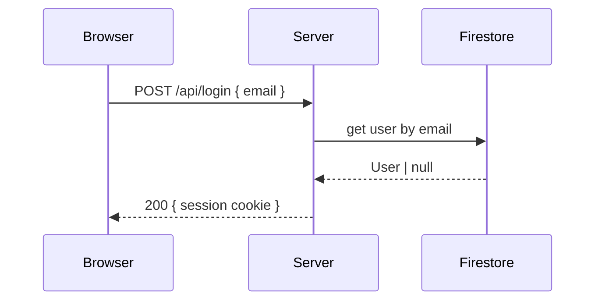
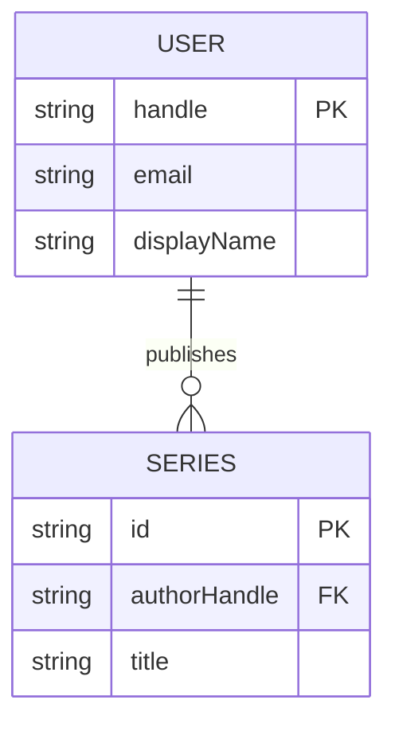
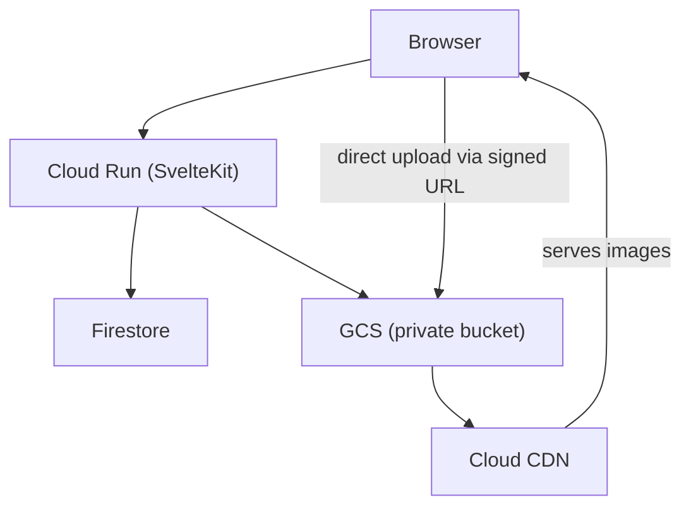
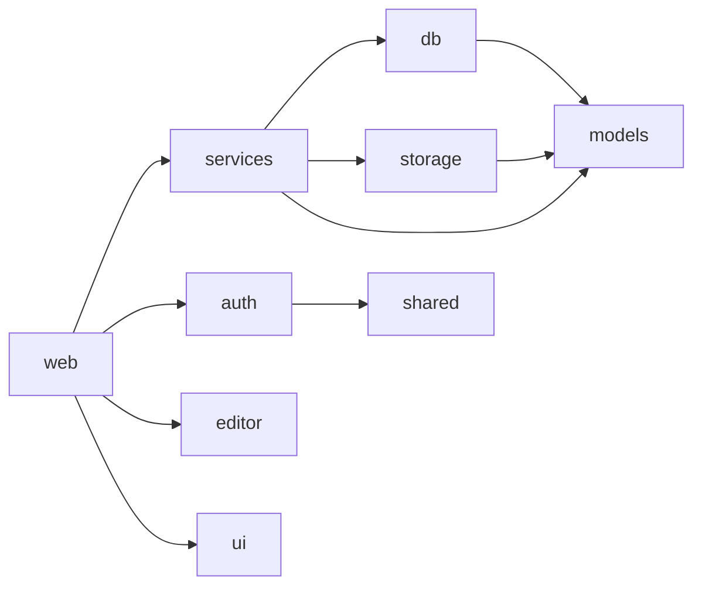
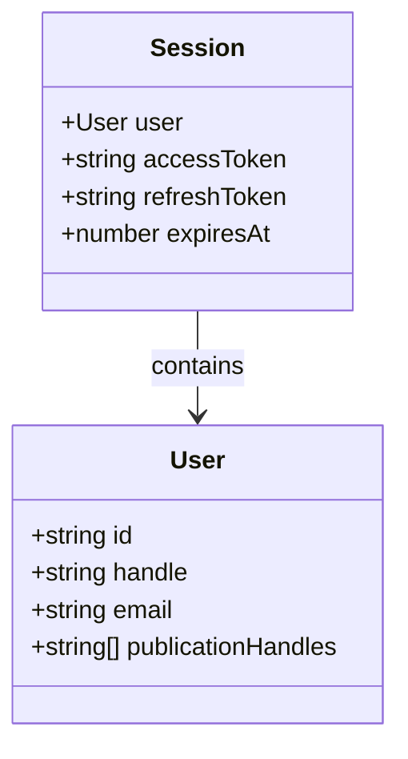
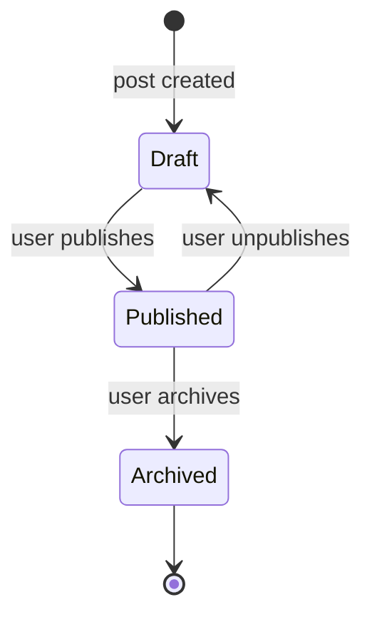

# Mermaid Diagram Guide

Prescribes which Mermaid diagram type to use for each kind of content. When in doubt, use the type listed here — consistency across docs is more valuable than the "perfect" diagram for a one-off situation.

## Diagram Type Quick Reference

| What you're documenting | Diagram type | Mermaid syntax |
|-------------------------|-------------|----------------|
| Network / API call sequence (browser → server → DB) | Sequence | `sequenceDiagram` |
| Auth flow (OAuth, login, token refresh) | Sequence | `sequenceDiagram` |
| Data model / entity relationships | ER | `erDiagram` |
| System components and how they connect | Flowchart (top-down) | `graph TD` |
| Library/package dependencies | Flowchart (left-right) | `graph LR` |
| A process with branching decisions | Flowchart (top-down) | `flowchart TD` |
| Component/class structure (TypeScript) | Class | `classDiagram` |
| State transitions | State | `stateDiagram-v2` |
| CI/CD pipeline stages | Flowchart (left-right) | `flowchart LR` |

## Templates by Type

### Sequence Diagram (network calls, auth flows)

````markdown

````

**Rules:**
- Name participants with their role, not their class name
- Use `-->>` for responses, `->>` for requests
- Use `Note over Browser,Server: text` for annotations
- Keep to ≤8 participants; split into two diagrams if larger

### ER Diagram (data models)

````markdown

````

**Rules:**
- PK and FK suffixes are required for clarity
- Use relationship labels as verbs: "publishes", "belongs to", "contains"
- Show only the fields a new reader needs to understand the model; omit internal timestamps etc.

### System Flowchart (components and topology)

````markdown

````

**Rules:**
- Put node labels in quotes when they need spaces or special characters: `["Cloud Run (SvelteKit)"]`
- Use edge labels for non-obvious connections: `-->|"reason"|`
- Group related nodes with `subgraph` when the diagram has more than ~8 nodes

### Library Dependency Graph

````markdown

````

**Rules:**
- Left-to-right orientation for dependency graphs (consumers on the left, leaf packages on the right)
- No arrow labels needed — direction implies "depends on"
- Leaf nodes (no deps) need no special styling

### Class Diagram (TypeScript types/interfaces)

````markdown

````

**Rules:**
- Use `+` for public, `-` for private
- Show the TypeScript type, not the JavaScript runtime type
- Limit to the types relevant to the component being documented

### State Diagram (lifecycle, status transitions)

````markdown

````

**Rules:**
- Use past-tense labels on transitions ("user publishes")
- Use `[*]` for entry/exit states
- Avoid showing error states unless they have transitions back to valid states

## When NOT to Use a Diagram

- Simple 2-step flows (just use prose or a bullet list)
- Flows already covered by a linked doc (link instead)
- Data with only 1 entity and 2 fields (use a table instead)
- Diagrams that would need more than 12 nodes (split into two diagrams)
