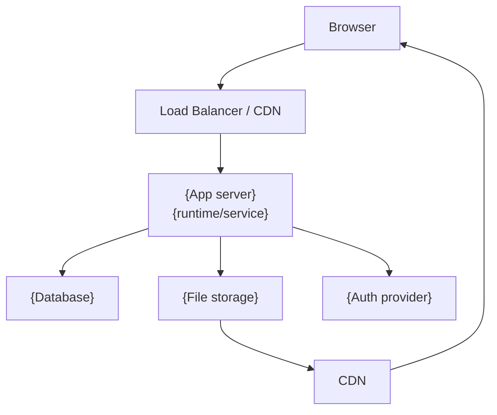
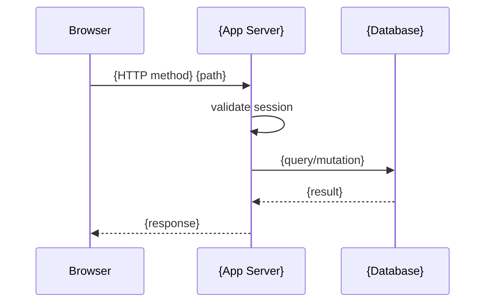
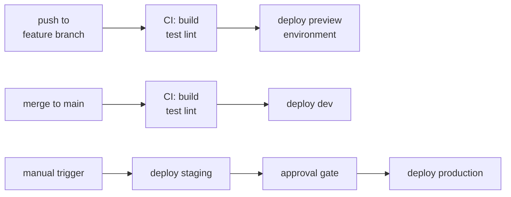

# Architecture

> {One-sentence summary of what this document covers.}

## Overview

{2-3 sentences. What is the system? What are its top-level responsibilities? What does it NOT do (important for scoping)?}

### Technology Stack

| Layer | Choice | Notes |
|-------|--------|-------|
| {layer} | {choice} | {optional note} |

### Monorepo / Repository Structure

```
{project-root}/
├── {dir}/    # {what lives here -- 1-line description}
│   └── {subdir}/  # {if needed}
├── {dir}/    # {what lives here}
└── docs/
```

## Requirements

<!-- What the system must do, as measurable properties. Not "how" -- that's Design. -->
<!-- A new engineer reading this should know what success looks like before they read Design. -->

- {e.g. All write operations are authenticated -- unauthenticated requests return 401}
- {e.g. Post content is served from CDN -- P95 load time < 200ms globally}
- {e.g. Each environment (dev, staging, prod) is fully isolated -- no shared state}
- {add/remove bullets as needed}

## Design

### Key Principles

<!-- 4-6 non-obvious design decisions that shape how everything is built. Include the "why" for each. -->

- **{Principle 1}**: {what + why -- e.g. "Infra as code: all infrastructure in Terraform. Never use the cloud console or framework-specific deploy commands -- changes must be reviewable."}
- **{Principle 2}**: {what + why}

### System Topology

<!-- A diagram showing the major components and their connections. -->



### Data Model

<!-- ER diagram for the core entities. Keep it to the 4-6 most important entities. -->

```mermaid
erDiagram
    {ENTITY_1} {
        string id PK
        string {field} FK
    }
    {ENTITY_2} {
        string id PK
        string name
    }
    {ENTITY_1} ||--o{ {ENTITY_2} : "{verb}"
```

### Authentication

{1-2 sentences describing the auth approach. Link to the component doc for details.}

See [`docs/architecture/auth.md`](auth.md).

### {Other major design concern -- e.g. "Environment Strategy"}

<!-- Table or short prose for environment isolation, deployment strategy, etc. -->

| Environment | {key property 1} | {key property 2} |
|-------------|------------------|------------------|
| {env name} | {value} | {value} |

## Implementation

### Request Lifecycle

<!-- Sequence diagram for a typical request, from browser to database and back. -->



### Library / Package Dependency Graph

<!-- Left-to-right flowchart. Consumers on left, leaf packages on right. -->

```mermaid
graph LR
    {app} --> {package-A}
    {package-A} --> {package-B}
    {package-B} --> {package-C}
```

### Infrastructure Layout

```
{infra-dir}/
├── {subdir}/   # {what this module provisions}
└── {subdir}/   # {what this module provisions}
```

### CI/CD

<!-- Flowchart showing what happens on push/merge to each environment. -->



## References

<!-- Link to every component doc, every relevant library README, and key external docs. -->

- [`docs/architecture/auth.md`](auth.md) -- authentication flow
- [`docs/architecture/storage.md`](storage.md) -- file storage and CDN
- {[`docs/architecture/{component}.md`]({component}.md) -- {description}}
- [`docs/development-guide.md`](../development-guide.md) -- local setup
