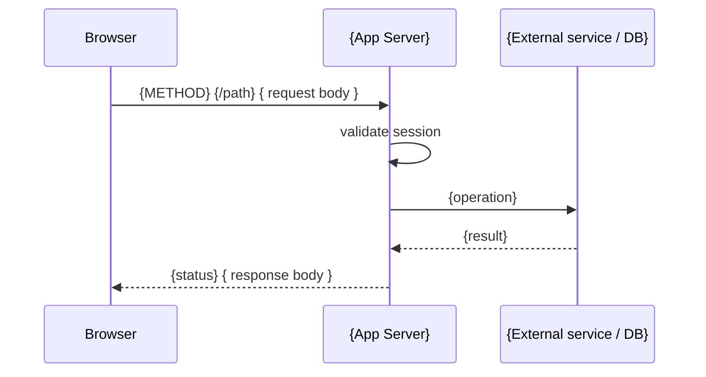

<!-- extends component-base.md -->
<!-- Use this template for: REST/RPC endpoint groups, route handlers, /api/ directories -->

# {Component Name} API

<!-- Component type: api -->
<!-- Path: {e.g. apps/web/src/routes/api/images} -->

## Overview

{What endpoints does this group expose? What resource do they manage? Who calls them (browser, server, external service)?}

## Requirements

- {e.g. All endpoints require a valid session cookie — unauthenticated requests return 401}
- {e.g. POST /upload-urls returns signed URLs that expire in 15 minutes}
- {e.g. Error responses always include a machine-readable `code` field}

## Design

### Endpoints

| Method | Path | Auth required | Description |
|--------|------|--------------|-------------|
| `{METHOD}` | `{/path}` | yes / no | {1-line description} |
| `{METHOD}` | `{/path}` | yes / no | {1-line description} |

### Request / Response Schemas

<!-- One subsection per endpoint. Delete unused subsections. -->

#### `{METHOD} {/path}`

**Request:**
```typescript
// {describe what the caller sends}
{
  {field}: {type}  // {description}
}
```

**Response (success — {status code}):**
```typescript
{
  {field}: {type}  // {description}
}
```

**Error responses:**
| Status | Code | When |
|--------|------|------|
| 400 | `{error_code}` | {condition} |
| 401 | `unauthorized` | No valid session |
| 500 | `internal_error` | Unexpected server error |

### Request Flow

<!-- Sequence diagram: how a request moves through the system. -->



### Authentication

{Describe auth requirements for this endpoint group. Which endpoints are public? Which require specific roles/permissions?}

### Rate Limiting / Quotas

{Describe any rate limits, quotas, or abuse-prevention measures. Delete if not applicable.}

## Implementation

### File Structure

```
{path}/
├── +server.ts    # {description — e.g. POST handler for upload URL generation}
└── {other files if applicable}
```

### {Key Implementation Detail — e.g. "Signed URL Generation"}

{Describe the non-obvious implementation. Why is it done this way?}

### Error Handling

{How are errors caught and formatted? What guarantees does the caller have about error shape?}

### Environment Variables

| Variable | Description | Required |
|----------|-------------|----------|
| `{VAR_NAME}` | {plain-English description} | yes / no |

## References

- `{path/to/handler.ts}` — main endpoint handler
- `{path/to/types.ts}` — request/response types
- [{External service docs}]({url}) — {why referenced}
- [`docs/architecture/{related}.md`]({related}.md) — {context}
