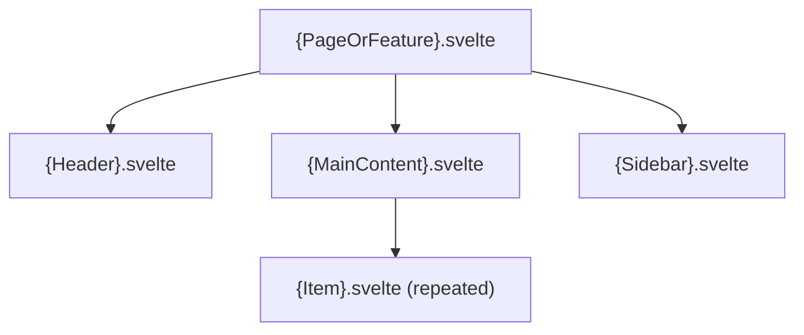

<!-- extends component-base.md -->
<!-- Use this template for: Svelte/React features, UI libs, client-side feature modules -->

# {Feature / Component Name}

<!-- Component type: frontend -->
<!-- Path: {e.g. libs/editor, apps/web/src/routes/(app)/write} -->

## Overview

{What UI does this feature render? What user need does it address? Who sees it and when?}

## Requirements

- {e.g. Must render correctly on mobile (≥320px) and desktop}
- {e.g. Must be keyboard-navigable — no mouse-only interactions}
- {e.g. Must load initial content within 1s on a 4G connection}
- {e.g. Must handle empty state, loading state, and error state}

## Design

### User Flow

<!-- How does the user interact with this feature? Flowchart for paths with branching. -->

```mermaid
flowchart TD
    A([User arrives at {page/feature}]) --> B{Authenticated?}
    B -- No --> C[Redirect to login]
    B -- Yes --> D[Load {data}]
    D --> E{Has {data}?}
    E -- No --> F[Show empty state]
    E -- Yes --> G[Render {main UI}]
    G --> H([User completes {action}])
```

### Component Tree

<!-- What components make up this feature? Top-down hierarchy. -->



### State Management

{How is state managed? Svelte stores, runes, signals, or server-fetched? What state is local vs. shared?}

### Key Design Decisions

{Non-obvious choices: why SSR vs CSR? Why this state approach? Any performance tradeoffs?}

## Implementation

### Components

| Component | File | Description |
|-----------|------|-------------|
| `{ComponentName}` | `{path/to/Component.svelte}` | {what it renders, 1 line} |

### Props and Events

#### `{ComponentName}.svelte`

**Props:**
| Prop | Type | Required | Description |
|------|------|----------|-------------|
| `{prop}` | `{type}` | yes / no | {description} |

**Events / Snippets:**
| Event / Snippet | Payload | Description |
|-----------------|---------|-------------|
| `on:{event}` | `{type}` | {when it fires} |

### Data Loading

{How does this feature load data? SvelteKit load functions, client-side fetch, or passed from parent?}

```typescript
// {path}/+page.server.ts (if SSR)
export async function load({ locals }) {
  // {describe what's loaded and why}
  return { {data} }
}
```

### Accessibility

{What a11y considerations apply? Keyboard navigation, ARIA labels, focus management, colour contrast.}

- {e.g. All interactive elements are reachable by Tab}
- {e.g. Form errors are announced to screen readers via `aria-live`}

## References

- `{path/to/main/component.svelte}` — main component
- `{path/to/+page.server.ts}` — data loading
- [{Design system / UI library}]({url}) — {components used from here}
- [`docs/architecture/{related}.md`]({related}.md) — {backend that feeds this feature}
