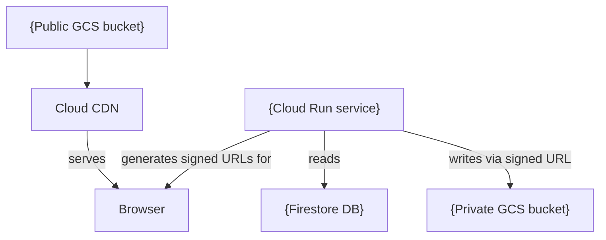

<!-- extends component-base.md -->
<!-- Use this template for: Terraform modules, infra/modules/*, infrastructure configuration -->

# {Module Name} Infrastructure

<!-- Component type: infra -->
<!-- Path: {e.g. infra/modules/cdn} -->

## Overview

{What cloud resources does this module provision? Who uses this module (which environments or root modules call it)? What would break if this module were removed?}

## Requirements

- {e.g. Creates one private GCS bucket per environment — no cross-environment access}
- {e.g. All resources are tagged with the environment name for cost attribution}
- {e.g. Destroy must be safe — no data loss on `terraform destroy` for preview environments}

## Design

### Resources Created

<!-- Table of all resources this module provisions. -->

| Resource type | Name pattern | Description |
|--------------|-------------|-------------|
| `{google_storage_bucket}` | `{name-pattern}` | {what it stores, who accesses it} |
| `{google_cloud_run_service}` | `{name-pattern}` | {what it serves} |
| `{google_iam_binding}` | — | {who gets what permission} |

### Architecture Diagram

<!-- Show resources and how they connect. -->



### Environment Isolation

{How does this module achieve per-environment isolation? Separate resources per env? Workspace-based naming? Path-based separation?}

### Security Model

{What IAM bindings are created? What service accounts are used? What should NEVER be accessible publicly?}

| Resource | Access | Granted to |
|----------|--------|-----------|
| `{resource}` | `{role}` | `{service account or principal}` |

## Implementation

### Module Inputs (Variables)

| Variable | Type | Default | Description |
|----------|------|---------|-------------|
| `{var_name}` | `{string/number/bool}` | `{default or required}` | {plain-English description} |

### Module Outputs

| Output | Value | Used by |
|--------|-------|---------|
| `{output_name}` | `{what it is}` | {who consumes this output} |

### File Structure

```
{module-path}/
├── main.tf         # resource definitions
├── variables.tf    # input variable declarations
├── outputs.tf      # output value declarations
└── README.md       # (this file)
```

### Deployment Steps

<!-- Ordered steps to apply this module. Include any manual prerequisites. -->

1. {Prerequisite: e.g. "Ensure the shared infra is applied first: `just tf-apply-shared`"}
2. Run `just tf-init {env}` to initialize the Terraform backend for this environment
3. Run `just tf-plan {env}` to preview the changes
4. Run `just tf-apply {env}` to apply

### Destroy / Teardown

{Is it safe to destroy? What data is lost? What manual cleanup is needed after?}

```bash
just tf-destroy {env}   # destroys all resources in this module for {env}
```

WARNING: {If data loss warning is needed: "This destroys the {private GCS bucket} and all files in it. Back up any files first."}

## References

- `{module-path}/main.tf` — resource definitions
- `{module-path}/variables.tf` — input variables
- [{Cloud provider docs for key resource}]({url}) — {why referenced}
- [`docs/infrastructure.md`](../infrastructure.md) — Terraform operations guide
