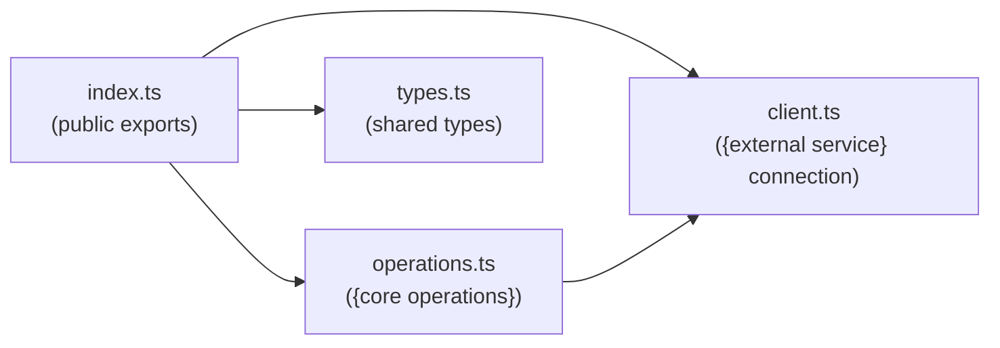

<!-- extends component-base.md -->
<!-- Use this template for: monorepo packages, libs/, TypeScript modules with a public API -->

# `{@scope/package-name}` Library

<!-- Component type: library -->
<!-- Path: {e.g. libs/auth} -->

## Overview

{What does this library do? Who imports it? What does it abstract away so callers don't have to think about it?}

## Requirements

- {e.g. Must work in both browser and server environments}
- {e.g. Must not expose internal Firestore types in the public API}
- {e.g. All async operations return typed results; never throws uncaught exceptions}

## Design

### Public API Surface

<!-- Everything a caller can import. Grouped by concern. -->

#### Exported functions

| Function | Signature | Description |
|----------|-----------|-------------|
| `{functionName}` | `({params}) => {return type}` | {1-line description} |

#### Exported types

```typescript
// {TypeName} — {1-line description}
export type {TypeName} = {
  {field}: {type}  // {description}
}
```

### Key Design Decisions

{Why is the API shaped this way? What alternatives were considered? What are the important constraints?}

### Internal Architecture

<!-- How is the library structured internally? Dependency flowchart if non-trivial. -->



## Implementation

### Usage Examples

<!-- The most common ways the library is used. Runnable code. -->

#### Basic usage

```typescript
import { {functionName} } from '@{scope}/{package-name}'

const result = await {functionName}({example args})
// result: {TypeName}
```

#### {Less common use case}

```typescript
// {explain when you'd use this}
import { {functionName} } from '@{scope}/{package-name}'

const result = await {functionName}({example args})
```

### File Structure

```
{lib-path}/
├── src/
│   ├── index.ts        # public exports — only import from here
│   ├── types.ts        # exported types and interfaces
│   ├── client.ts       # {description — e.g. external service singleton}
│   └── {feature}.ts    # {description}
└── package.json
```

### Configuration

{How is the library configured? Constructor options, environment variables, or module-level constants?}

| Variable / Option | Description | Default |
|-------------------|-------------|---------|
| `{name}` | {description} | `{default}` |

### Error Handling

{What errors can the library throw? How should callers handle them?}

```typescript
try {
  const result = await {functionName}(args)
} catch (error) {
  if (error instanceof {ErrorType}) {
    // {how to handle this specific error}
  }
}
```

## References

- `{lib-path}/src/index.ts` — public API entry point
- `{lib-path}/src/types.ts` — exported types
- [{External service}]({url}) — {the service this library wraps}
- {[`docs/architecture/{related}.md`]({related}.md) — {architecture context}}
