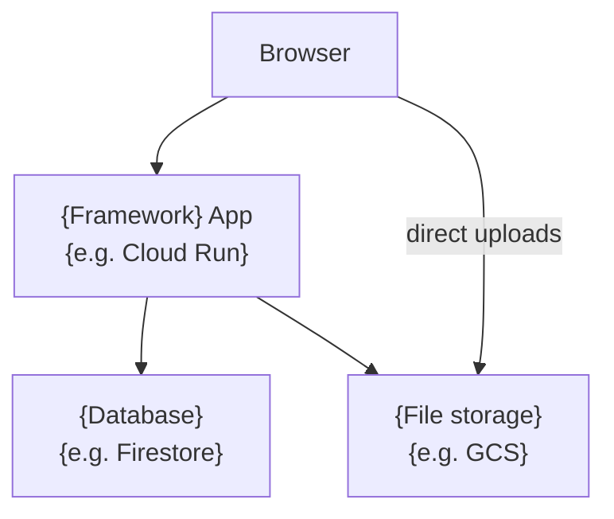

# {Project Name} — Developer Docs

> {One sentence: what this project does and who it's for.}

## Overview

{2-3 sentences: what the project is, what problem it solves, and who uses it. Avoid internal jargon -- a new hire on day 1 should understand this.}

## Technology Stack

| Layer | Choice | Why |
|-------|--------|-----|
| {e.g. Web framework} | {e.g. SvelteKit} | {1-line rationale} |
| {e.g. Database} | {e.g. Firestore} | {1-line rationale} |
| {e.g. Auth} | {e.g. Kinde} | {1-line rationale} |
| {e.g. Infrastructure} | {e.g. GCP + Terraform} | {1-line rationale} |

<!-- Add/remove rows as needed. The "Why" column is important -- it prevents future engineers from asking "why didn't they use X?" -->

## Repository Structure

```
{project-root}/
├── {apps/ or src/}          # {what lives here}
├── {libs/ or packages/}     # {what lives here}
├── {infra/ or terraform/}   # {what lives here}
└── docs/                    # you are here
```

## Quick Start

<!-- This section gets a developer from zero to running the app in under 5 minutes. -->

**Prerequisites:** {list tools with install links, e.g.}
- [just](https://github.com/casey/just#installation) -- command runner
- [pnpm](https://pnpm.io) -- package manager
- [gcloud CLI](https://cloud.google.com/sdk) -- only needed if the project uses GCP

```bash
git clone {repo-url}
cd {project-name}
{install command}     # e.g. pnpm install
{env setup}           # e.g. cp .env.example .env.local
{run command}         # e.g. just dev
```

## System Architecture

<!-- A high-level diagram showing the major components and how they interact. Replace the example below. -->



See [`docs/architecture/README.md`](architecture/README.md) for a full breakdown.

## Key Concepts

<!-- 3-5 concepts a new contributor needs to understand before reading architecture docs. Define acronyms here. -->

- **{Concept 1}** -- {1-sentence plain-English definition}
- **{Concept 2}** -- {1-sentence plain-English definition}

## Common Commands

```bash
{list task runner commands with descriptions, e.g.}
just dev           # start the dev server
just test          # run the test suite
just lint          # lint all packages
just build         # production build
```

## Environments

| Environment | Deployed when | URL |
|-------------|--------------|-----|
| preview | push to feature branch | {pattern, e.g. pr-{N}.dev.example.com} |
| dev | merge to main | {url} |
| staging | manual trigger | {url} |
| production | manual + approval | {url} |

## References

- [`docs/architecture/README.md`](architecture/README.md) -- full system architecture
- [`docs/development-guide.md`](development-guide.md) -- detailed local setup
- {link to CI/CD docs}
- {link to deployment docs}
