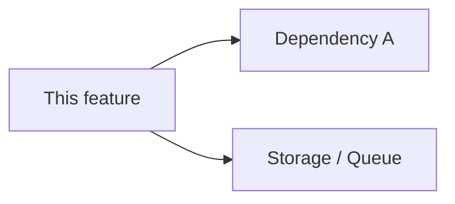
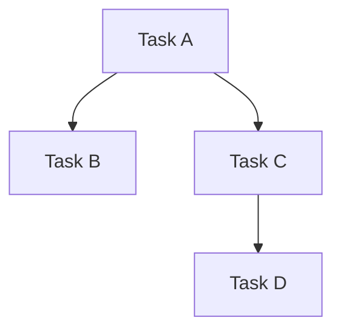

# plan

Plan software architecture for a project or feature. Writes drafts to `.codevoyant/plans/`.

## Step 0.5: System Audit

```bash
git log --oneline -10
ls .codevoyant/plans/ 2>/dev/null || echo "(no existing plans)"
ls docs/architecture/ 2>/dev/null || echo "(no existing arch docs)"
```

If `docs/architecture/README.md` exists, read it — use as context so this plan doesn't duplicate existing decisions.

## Step 1: Gather Design Context

If `PLAN_MODE` is unset, ask:

AskUserQuestion:
  question: "What kind of plan is this?"
  header: "Plan mode"
  options:
    - label: "Architecture (--mode arch)"
      description: "System or component design — produces task breakdown with LOE and blocking relationships"
    - label: "Feature implementation (--mode feat)"
      description: "A specific feature within a known architecture — produces a design doc only"

Set `PLAN_MODE` from the answer before continuing.

Ask:

1. "What scope are we designing?" — options: New feature | Refactor existing system | Cross-cutting concern (auth, logging, etc.) | Greenfield project
2. "What do you know about the design already?" — free text; may be empty ("I need you to research and propose")
3. "Confidence level?" — Already decided (document it) | Exploring options | Spike needed (too many unknowns)

## Step 2: Parallel Research

Launch two background agents (`model: claude-haiku-4-5-20251001`, `run_in_background: true`):

**Agent R1 — Codebase Scan:** Glob/Grep for files, patterns, and systems relevant to this feature. Note existing architecture decisions, naming conventions, and test coverage. Return structured findings.

**Agent R2 — Existing Architecture Docs:** Read all files in `docs/architecture/`. Identify: what the current system looks like, what decisions are already recorded, what this feature touches. Flag gaps or contradictions with proposed design.

Wait for both agents. Synthesize: highlight what's new vs. what integrates with existing decisions.

## Step 3: Architecture Design

Based on context and research, produce the architecture document content:

### Sections (required):

**Context** — what system/feature this is in, why now

**Design Decision** — the architectural choice made (or top 2-3 options if exploring). For each option: trade-offs, complexity, reversibility.

**Data Model** — entities, relationships, storage. ASCII diagram if schema is non-trivial.

**System Boundaries** — what this feature owns vs. delegates. Use a Mermaid flowchart:



**API Surface** — new or modified interfaces (method, path/name, request/response shape). Mark N/A if internal only.

**Key Decisions** — table of one-way vs two-way doors:
| Decision | Type | Rationale |
|---|---|---|
| {decision} | ONE-WAY (!) / TWO-WAY | {why this path} |

**Failure Modes** — top 3 ways this can fail, with mitigation:
| Failure | Trigger | Mitigation |
|---|---|---|
| {class} | {condition} | {rescue action} |

**Open Questions** — unknowns that need resolution before implementation starts

**Out of Scope** — explicitly deferred design concerns

### Design principles:

- Boring by Default: name any existing library or pattern that could be reused instead of building
- If a section is unknown: write `[spike needed]`, not omit it
- Decisions table: every one-way door must have a rationale

## Step 4: Confirmation

Show a one-paragraph summary of the design. AskUserQuestion:

```
question: "Does this architecture look right?"
header: "Design Review"
options:
  - label: "Looks good — write the docs"
    description: "Write feature doc and update overview"
  - label: "Revise the design"
    description: "I'll describe what to change"
  - label: "Mark as exploratory"
    description: "Write as a proposal, not a decision"
```

Loop on revisions until "Looks good" or "Mark as exploratory".

## Step 5: Write Plan Files

Write `{PLAN_DIR}/plan.md` with all architecture doc sections:
- Context
- Design Decision
- Data Model
- System Boundaries (Mermaid diagram preferred over ASCII)
- API Surface
- Key Decisions table
- Failure Modes table
- Open Questions
- Out of Scope

If "Mark as exploratory": prepend `> **Status: Proposal** — not yet decided`.

### Task Breakdown (if PLAN_MODE is arch)

If `PLAN_MODE` is `arch` (or scope chosen was "Refactor existing system" or "Greenfield project"), append a `## Task Breakdown` section to `plan.md`:

For each implementation task identified during design, write a self-contained entry rich enough for an autonomous agent to run `/spec new` and `/spec bg` without further human input:

### {task name}
- **LOE**: {N} hours (rough estimate)
- **Blocks**: {list of task names this task must complete before, or "none"}
- **Blocked by**: {list of task names that must complete first, or "none"}
- **Architecture reference**: `{PLAN_DIR}/plan.md` → `## {Section name}` (e.g. `## Design Decision`, `## API Surface`)
- **Scope**: {one paragraph — what specifically must be built or changed to implement this task}
- **Key constraints**: {relevant ONE-WAY door decisions from the Key Decisions table that apply to this task}
- **Acceptance criteria**:
  - {specific, verifiable condition checkable in under 5 minutes}
  - {another AC — e.g. unit test passes, endpoint returns expected shape, migration is idempotent}

Include a Mermaid dependency graph if there are blocking relationships:


## Step 7: Report + Notify

Register the plan:

```bash
npx @codevoyant/agent-kit plans register \
  --name "{FEATURE_SLUG}" \
  --plugin dev \
  --description "{first line of Context section}" \
  --total "{task count from Task Breakdown, or 0}"
```

Report:
```
Plan written to .codevoyant/plans/{FEATURE_SLUG}/plan.md
Run /dev approve to promote to docs/architecture/.
```

If `BG_MODE=true` and `SILENT=false`:
```bash
npx @codevoyant/agent-kit notify --title "dev plan complete" --message "Architecture plan saved: .codevoyant/plans/{FEATURE_SLUG}/"
```
