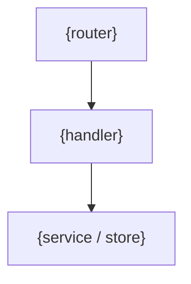
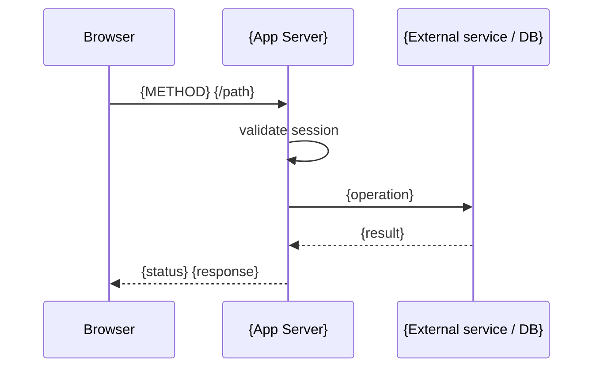

# {name}

## Overview

<!-- @human: 3 sentences max. What endpoints does this group expose? What resource do they manage? Who calls them? Define acronyms on first use. -->

## Requirements

### Functional

<!-- @agent: What the endpoints must do — auth/access rules, response shape, accepted inputs. Phrase as "must", "returns", "rejects". Follow R1–R3, R6 in requirements-guidance.md: no implementation terms (they belong in Design/Implementation), wording must survive an implementation change, each requirement names an observable outcome, domain claims carry a Source or [ASSUMPTION — unvalidated]. -->

- {auth/access requirement}
- {response-shape requirement}

### Non-Functional

<!-- @agent: Constraints on how they behave — rate limits, latency, idempotency, security. Numbers where measurable. Follow R4, R7 in requirements-guidance.md. -->

- {rate-limit / latency requirement}

## Design

### Components

<!-- @agent: (optional) graph TD of how this endpoint group is wired — router, handlers, the services/stores it calls. Delete if the Components list is clearer on its own. -->



<!-- @agent: [components] The endpoint group's key parts, one bullet each. When this doc delegates to a sub-component with its OWN doc, NAME + LINK it, referencing that doc's public API section — never its internals. -->

- {key part} — {what it does}
- [`{sub-component}`]({sub-component}.md) — {delegated sub-component}

### API

<!-- @agent: [public-api] This is the API's public surface — the ONLY thing other docs may reference. Table of every endpoint: Method, Path, Auth, one-line description. -->

| Method     | Path      | Auth     | Description          |
| ---------- | --------- | -------- | -------------------- |
| `{METHOD}` | `{/path}` | yes / no | {1-line description} |

#### Request / Response Schemas

<!-- @agent: Request and response bodies per endpoint, plus the error table. -->

##### `{METHOD} {/path}`

**Request:**

```typescript
{
  {field}: {type}  // {description}
}
```

**Response ({status code}):**

```typescript
{
  {field}: {type}
}
```

**Errors:**

| Status | Code           | When             |
| ------ | -------------- | ---------------- |
| 400    | `{error_code}` | {condition}      |
| 401    | `unauthorized` | No valid session |

#### Data Model

<!-- @agent: The persistent/domain entities this API owns. erDiagram for 3+ related entities, or a type table for a small set. Distinct from the wire schemas above — what the API stores, not what it sends. Ensure diagram is not too wide horizontally, split into multiple diagrams if needed. -->

```mermaid
erDiagram
    {ENTITY_1} {
        string id PK
    }
    {ENTITY_2} {
        string id PK
    }
    {ENTITY_1} ||--o{ {ENTITY_2} : "{verb}"
```

## Implementation

### Request Flow

<!-- @agent: sequenceDiagram of the request lifecycle for 4+ steps; numbered list for shorter flows. -->



### Query Patterns

<!-- @human: explain data user patterns and consequent query patterns/optimizations. This is nearly always necessary in api documentation. -->

### Configuration / Environment Variables

<!-- @agent: (optional) Env vars the endpoint group reads at runtime. Delete if none. -->

| Variable     | Description   | Required |
| ------------ | ------------- | -------- |
| `{VAR_NAME}` | {description} | yes / no |

## References

<!-- @agent: Technical/external references actually used — external service/API docs, protocol specs, standards, and the handler source files. NOT sibling/sub-component doc links (those go in Components). Real verified sources. -->

- `{path/to/handler.ts}` -- endpoint handler
- [{External service docs}]({url}) -- {why referenced}
