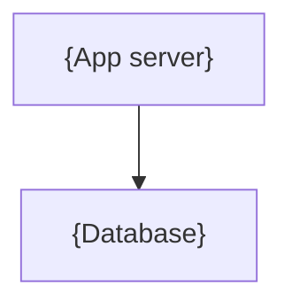

# {name}

## Overview

<!-- @agent: 3 sentences max. What is the system? Its top-level responsibilities? What does it explicitly NOT do — the scoping statement matters as much as the inclusions. -->

### Technology Stack

<!-- @agent: Table of the load-bearing choices per layer. One row per layer. -->

| Layer   | Choice   | Notes  |
| ------- | -------- | ------ |
| {layer} | {choice} | {note} |

### Repository Structure

<!-- @agent: Tree of top-level directories, one-line description per entry. -->

```
{project-root}/
├── {dir}/    # {what lives here}
└── docs/architecture/index.md    # this doc
```

## Design

### Components

<!-- @agent: (optional) graph TD of the system topology — major components and their connections. No ASCII art. Delete if the Components list is clearer on its own. -->



<!-- @agent: [components] The system's major components. NAME every component and LINK its doc, referencing that doc's public API section: a leaf as `./{component}.md`, a component with sub-components as `./{component}/index.md`. Do not restate internals. -->

- [`{component}`]({component}.md) — {what it does}
- [`{component}`]({component}/index.md) — {what component does}
- {additional bullets explaining how the components wire together to create the whole}

## Implementation

### Dependency Graph

<!-- @agent: Left-to-right flowchart. Consumers on the left, leaf packages on the right. -->

```mermaid
graph LR
    {app} --> {package-A}
    {package-A} --> {package-B}
```

### {Section Heading, Repeats}

<!-- @agent: use sections with headings to explain key implementation details. Can be simple bullets instead if component is simple. -->

## References

<!-- @agent: Technical/external references actually used — upstream framework/library docs, specs, standards, load-bearing source files. NOT component or sibling doc links (those go in Components). Real verified sources. -->

- [{Framework/platform docs}]({url}) -- {why referenced}
- `{path/to/config}` -- {load-bearing config}
