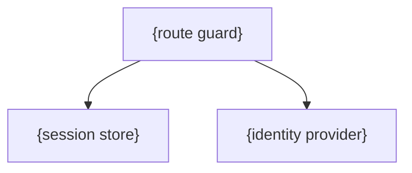
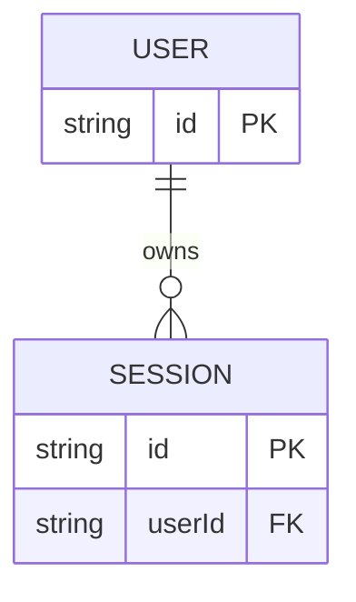
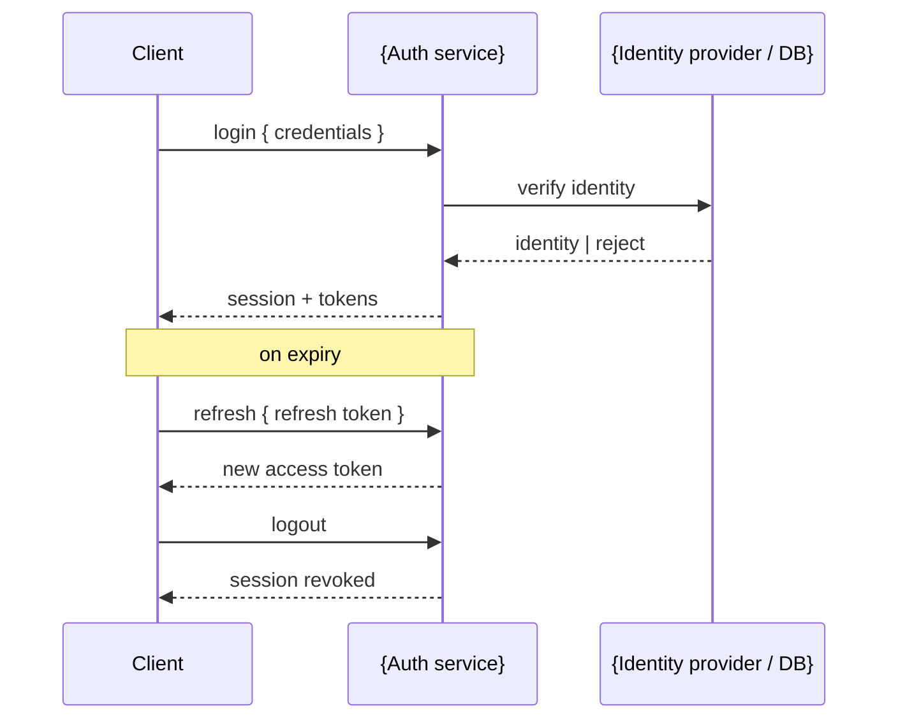

# {name}

## Overview

<!-- @agent: 3 sentences max. What identities does this authenticate? What protocol does it use (OpenID Connect (OIDC), OAuth, session cookies)? What breaks without it? Define acronyms on first use. -->

## Requirements

### Functional

<!-- @agent: What auth must do — which identities it accepts, which flows it supports (login, refresh, logout). Phrase as "must", "rejects". -->

- {e.g. Must issue a session on valid credentials}
- {e.g. Must reject expired or tampered tokens}

### Non-Functional

<!-- @agent: Constraints on how it behaves — token lifetime, storage, transport, revocation. -->

- {e.g. Tokens must be signed and short-lived}
- {e.g. Must not expose refresh tokens to client-side JavaScript}

## Design

### Components

<!-- @agent: (optional) graph TD of the auth component's structure — guard/middleware, session store, identity provider. Delete if the Components list is clearer on its own. -->

<!-- @agent: [components] The auth component's key parts, one bullet each (guard, session store, provider client). When this doc delegates to a sub-component with its OWN doc, NAME + LINK it, referencing that doc's public API section — never its internals. -->

- {key part} — {what it does}
- [`{sub-component}`]({sub-component}.md) — {delegated sub-component}

### API

<!-- @agent: [public-api] The PUBLIC interface only — the functions and types callers use to authenticate, guard routes, and read the current identity. This is the ONLY surface cross-module docs may reference. Internal details MUST NOT be mentioned. -->

#### Data/Types

<!-- @agent: Public data types (Session, Identity, tokens) and their meanings. -->

#### Functions/Classes

<!-- @agent: Public functions — login, logout, refresh, requireAuth/guard, getSession — and their purpose. -->

#### Configuration

<!-- @agent: (optional) Auth config: provider URLs, cookie settings, token TTLs. Delete if none. -->

### Session / Token Format

<!-- @agent: The shape of the session or token this component issues — claims, lifetime, where it is stored (cookie, header, storage). Name the algorithm and expiry. -->

| Field | Meaning | Lifetime |
|-------|---------|----------|
| `{claim}` | {what it carries} | {ttl} |

### Security Properties

<!-- @agent: The guarantees this auth provides — signing, transport, CSRF/XSS defenses, revocation. One bullet per property, each with the mechanism that enforces it. -->

- {property}: {mechanism}

### Data Model

<!-- @agent: The identity/session entities this component owns. erDiagram for 3+ related entities, or a type table for a small set. Public types only — no internals. -->

## Implementation

### Auth Flow

<!-- @agent: sequenceDiagram of login, refresh, and logout. Show the token/session exchange between client, auth server, and any external identity provider. Must be a sequenceDiagram, not prose. -->

### Modules/Objects

<!-- @agent: Internal module layout and how the public API is wired to the identity provider and session store. Internal detail only; never referenced by other docs. -->

### Environment Variables

<!-- @agent: (optional) Env vars the auth component reads at runtime. Delete if none. -->

| Variable | Description | Required |
|----------|-------------|----------|
| `{VAR_NAME}` | {description} | yes / no |

## References

<!-- @agent: Technical/external references actually used — the identity provider's docs, auth protocol specs (OIDC, OAuth), security standards, and the source files. NOT sibling/architecture doc links (those go in Components). Real verified sources. -->

- `{path}/src/index.ts` — public API entry point
- [{Identity provider}]({url}) — {the provider this wraps}
- [{Auth protocol spec}]({url}) — {OIDC / OAuth spec referenced}
