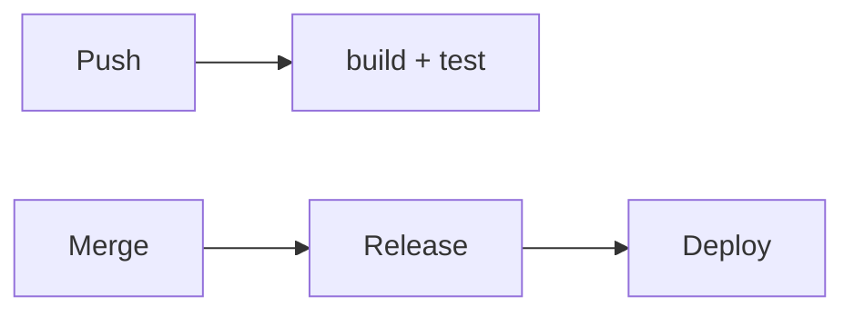

# {name}

## Overview

<!-- @agent: 3 sentences max. What runs the pipeline and where does it deploy? What does it produce? When does it run (push, pull request, merge)? -->



## Pipelines

<!-- @agent: One subsection per workflow file. For each: trigger → jobs → outcome. -->

### {workflow-name} (`.github/workflows/{file}.yml`)

| Trigger             | Jobs   | Outcome  |
| ------------------- | ------ | -------- |
| {event} on {branch} | {jobs} | {result} |

## Release

<!-- @agent: How versions are cut and published. Name the tool (semantic-release, release-it, commitizen) and the trigger. -->

1. {version bump on {trigger}}
2. {build}
3. {publish to {registry}}

## Infrastructure

<!-- @agent: (optional) The infra layout broken into modules and environments. Delete this whole section (and its subsections) if the repo has no managed infra. Reference each infra COMPONENT doc through its API, not its internals. -->

### Modules

<!-- @agent: (optional) The infra modules — what each one provisions. Tree of the infra dir with a one-line note per module, then one subsection per module: what it provisions, what it exposes, and a link to its COMPONENT doc (referencing that doc's API, not its internals). Delete if no managed infra. -->

```
{infra-dir}/
├── {module}/    # {what this module provisions}
└── {module}/    # {what this module provisions}
```

#### {module-name}

<!-- @agent: What this module provisions, the resource/interface it exposes, and which COMPONENT doc owns its details (link it here, referencing its API section). Delete if the module has no component doc. -->

### Environments

<!-- @agent: (optional) Table of environments: name, deploy trigger, URL, and which modules each environment instantiates. Delete if no managed infra. -->

| Environment | Deployed when | URL | Modules |
|-------------|--------------|-----|---------|
| {env}       | {trigger}    | {url} | {modules} |

### Provisioning

<!-- @agent: (optional) How infra is provisioned — Terraform (state backend, workspaces, plan/apply) and/or Kubernetes (manifests, Helm/Kustomize, rollout). Delete if none. -->

### Resources

<!-- @agent: (optional) Table of the load-bearing resources: type, purpose, who accesses it. Delete if no managed infra. -->

| Resource     | Purpose        | Accessed by |
| ------------ | -------------- | ----------- |
| `{resource}` | {what it does} | {principal} |

## Secrets

<!-- @agent: Required CI and infra secrets — name, purpose, scope (repo/org). Never include secret values. -->

| Secret          | Purpose                 | Scope      |
| --------------- | ----------------------- | ---------- |
| `{SECRET_NAME}` | {what it authenticates} | repo / org |

## References

<!-- @agent: Technical/external references actually used — the CI provider docs, release tool docs, cloud provider docs, and the workflow/infra source files. NOT sibling doc links. Real verified sources. -->

- `.github/workflows/{file}.yml` — {what it does}
- [{CI provider docs}]({url}) — {why referenced}
