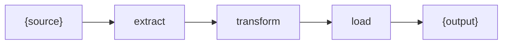

# {name}

## Overview

<!-- @human: 3 sentences max: what this pipeline ingests and produces, who consumes the output, what breaks without it. Define acronyms on first use. -->

## Requirements

### Functional

<!-- @agent: Expected behavior: the schema of the output, freshness/latency the consumer relies on, idempotency or replay behavior. Phrase as "must", "produces". Follow R1–R3, R6 in requirements-guidance.md: no implementation terms (they belong in Design/Implementation), wording must survive an implementation change, each requirement names an observable outcome, domain claims carry a Source or [ASSUMPTION — unvalidated]. Invariants are NOT expected behavior — keep them out of Functional (R5). -->

- {requirement}

### Non-Functional

<!-- @agent: Constraints — throughput, freshness SLO, retry/backoff, queue/worker sizing, cost. Numbers. Follow R4, R7 in requirements-guidance.md. -->

- {requirement}

## Design

### Inputs

<!-- @agent: The source(s) the pipeline ingests — schema, volume, cadence. -->

### Outputs

<!-- @agent: The artifact(s) the pipeline produces — schema, destination, freshness. -->

### Stage

<!-- @agent: graph LR of the stages (extract → transform → load → validate). Required — always a diagram, never ASCII art. -->

### API

<!-- @agent: [public-api] The run/trigger entry point and the output artifact(s) consumers read. Runnable code. This is the ONLY surface cross-module docs may reference. -->

## Implementation

### {Section Heading, Repeats}

<!-- @human: Per-stage lower-level detail and internal invariants — e.g. "the extractor is single-flight; a concurrent run must not double-emit". Invariants are NOT expected behavior; keep them out of Functional. One subsection per topic. -->

## References

<!-- @agent: Technical/external references actually used — upstream source system docs, framework docs, destination/store docs. Real verified sources. -->

- [{Reference}]({url}) — {why}
