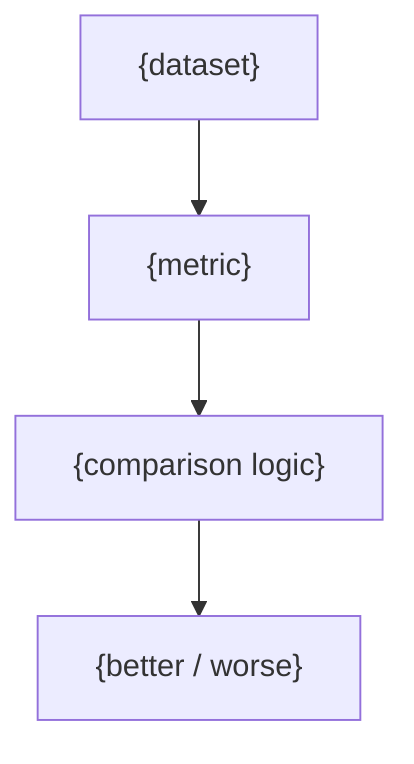

# {name}

## Overview

<!-- @agent: 3 sentences max: what this experiment evaluates, the hypothesis, and what decision its result informs. -->

## Requirements

### Functional

<!-- @agent: Expected behavior: the metric(s) computed, the comparison the experiment performs, what "success" means for the stated hypothesis. Phrase as "must", "reports". -->

- {requirement}

### Non-Functional

<!-- @agent: Constraints — runtime, resource budget, seed/reproducibility, metric compute cost. Numbers. -->

- {requirement}

## Design

### Dataset

<!-- @agent: The dataset(s) under evaluation — source, split, what each split measures. -->

### Model / Config Under Test

<!-- @agent: The model or configuration being evaluated, and the baseline it is compared against. -->

### Metric Set

<!-- @agent: graph TD/LR of the metric(s) computed and the comparison logic — what "better" means. Required — always a diagram, never ASCII art. -->

### API

<!-- @agent: [public-api] The run entry point and the metrics/log it emits. Runnable code. This is the ONLY surface cross-module docs may reference. -->

## Implementation

### {Section Heading, Repeats}

<!-- @agent: Runner lower-level detail and internal invariants — e.g. "the runner pins the random seed per run and must be deterministic given a seed". Invariants are NOT expected behavior; keep them out of Functional. -->

## References

<!-- @agent: Technical/external references actually used — dataset paper, metric definition, experiment framework docs. Real verified sources. -->

- [{Reference}]({url}) — {why}
