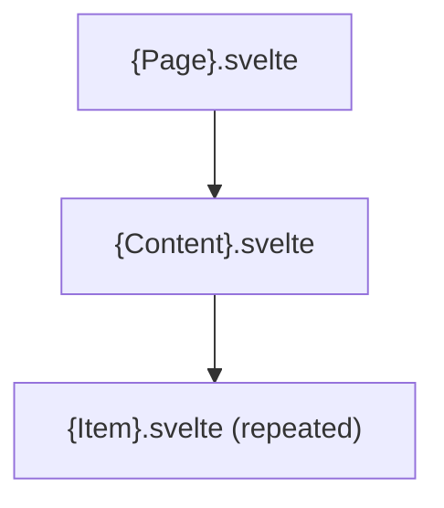
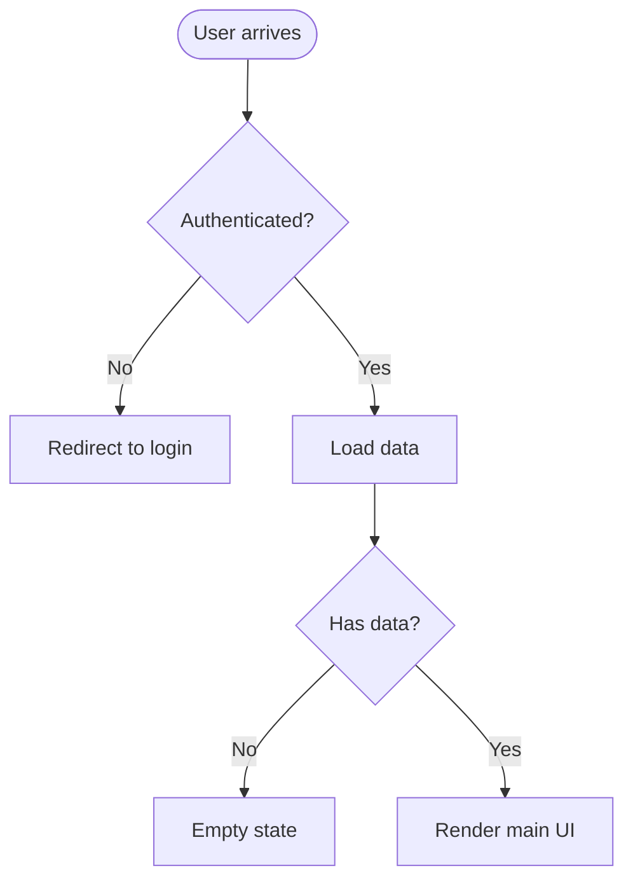

# {name}

## Overview

<!-- @human: 3 sentences max. What UI does this render? What user need does it address? Who sees it? Define acronyms on first use. -->

## Requirements

### Functional

<!-- @agent: What the feature must render and do — states it must handle: empty, loading, error. Follow R1–R3, R6 in requirements-guidance.md: no implementation terms (component names belong in Design), wording must survive an implementation change, each requirement names an observable outcome, domain claims carry a Source or [ASSUMPTION — unvalidated]. -->

- {state requirements: empty, loading, error}

### Non-Functional

<!-- @agent: Constraints on how it behaves — responsiveness, accessibility, performance. Numbers where measurable. Follow R4, R7 in requirements-guidance.md. -->

- {responsive/a11y requirement}
- {performance requirement}

## Design

### Components

<!-- @agent: (optional) graph TD of the component hierarchy. Delete if the Components list is clearer on its own. -->

<!-- @agent: [components] The feature's key parts, one bullet each. When this doc delegates to a sub-feature with its OWN doc, NAME + LINK it, referencing that doc's public API section (its exposed components) — never its internals. -->

- {key part} — {what it renders/does}
- [`{sub-feature}`]({sub-feature}.md) — {delegated sub-feature}

### User Flow

<!-- @agent: flowchart TD of user navigation and states. -->

### State Management

<!-- @human: How is state managed? What is local vs shared? WHY that choice. -->

### API

<!-- @agent: [public-api] The public surface — components this feature exports for other features to render, plus their props. This is the ONLY surface cross-module docs may reference. Omit internal-only components. -->

| Component | Props | Description |
|-----------|-------|-------------|
| `{Name}` | `{prop: type}` | {what callers render} |

## Implementation

### Component Files

<!-- @agent: Table of the components: name, file, what it renders. -->

| Component | File | Description |
|-----------|------|-------------|
| `{Name}` | `{path}` | {what it renders} |

### Data Loading

<!-- @human: How this feature loads data — loader, fetch, store. -->

### Accessibility

<!-- @human: Keyboard navigation and screen-reader support specifics. -->

- {keyboard navigation}
- {screen reader support}

## References

<!-- @agent: Technical/external references actually used — framework docs, the design system, accessibility standards, and the component source files. NOT sibling/backend doc links (those go in Components). Real verified sources. -->

- `{path}/{component}.svelte` -- main component
- [{Design system}]({url}) -- {components used}
