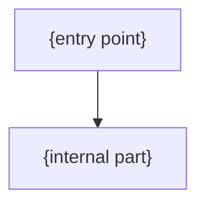

# {name}

## Overview

<!-- @human: 3 sentences max: what is this, where does it live, why does it exist (what breaks without it). Define every acronym on first use. -->

## Requirements

### Functional

<!-- @agent: What the component must do — the behaviour callers depend on. Phrase as "must", "returns", "rejects". Follow R1–R3, R6 in requirements-guidance.md: no implementation terms (they belong in Design/Implementation), wording must survive an implementation change, each requirement names an observable outcome, domain claims carry a Source or [ASSUMPTION — unvalidated]. -->

- {requirement}

### Non-Functional

<!-- @agent: Constraints on how it behaves — performance, security, reliability, operability. Numbers where measurable. Follow R4, R7 in requirements-guidance.md. -->

- {requirement}

## Design

### Components

<!-- @agent: (optional) graph TD of this component's internal structure. Delete if the Components list is clearer on its own. -->

<!-- @agent: [components] The component's key building blocks, one bullet each. When this doc delegates to a sub-component with its OWN doc, NAME + LINK it (a leaf as `./{sub}.md`, one with children as `./{sub}/index.md`), referencing that doc's public API section — never its internals. -->

- {key part} — {what it does}
- [`{sub-component}`]({sub-component}.md) — {what delegated sub-component does}

### API

<!-- @agent: [public-api] The public interface other modules may use — exported functions, types, entry points. This is the ONLY surface cross-module docs may reference. Do not list internals. -->

## Implementation

### {Section Heading, Repeats}

<!-- @human: use sections with headings to explain key implementation details. For a multi-component MODULE doc, use ONE `### {member}` subsection per member component — this is where Terraform modules, Lambda handlers, config files, and infra artifacts appear. Can be simple bullets instead if the module is simple. -->

## References

<!-- @agent: Technical/external references actually used — upstream library/framework docs, specs, standards, load-bearing source files. NOT sibling/sub-component doc links (those go in Components). Real verified sources. -->

- [{External dependency docs}]({url}) -- {why referenced}
