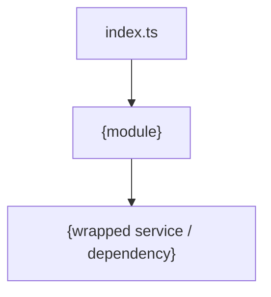

# {name}

## Overview

<!-- @human: 3 sentences max. What does this library do, who imports it, what does it abstract away? Define acronyms on first use. -->

## Requirements

### Functional

<!-- @agent: What the library must do, as measurable obligations. Phrase as "must", "returns". Follow R1–R3, R6 in requirements-guidance.md: no implementation terms (they belong in Design/Implementation), wording must survive an implementation change, each requirement names an observable outcome, domain claims carry a Source or [ASSUMPTION — unvalidated]. -->

- {e.g. Must work in both browser and server environments}

### Non-Functional

<!-- @agent: Constraints on how it behaves — API surface, error handling, performance. Numbers where measurable. Follow R4, R7 in requirements-guidance.md. -->

- {e.g. Must not expose internal Firestore types in the public API}

## Design

### Components

<!-- @agent: (optional) graph TD of the library's internal object/module structure. Delete if the Components list is clearer on its own. -->



<!-- @agent: [components] The library's key building blocks, one bullet each. When this doc delegates to a sub-package with its OWN doc, NAME + LINK it, referencing that doc's public API section — never its internals. -->

- {key part} — {what it does}
- [`{sub-package}`]({sub-package}.md) — {delegated sub-package}

### Usage

<!-- @agent: Runnable code for the most common ways the library is used. Lead with the most common. -->

#### {Most common use case}

```typescript
import { {functionName} } from '@{scope}/{package-name}'

const result = await {functionName}({example args})
// result: {TypeName}
```

### API

<!-- @agent: [public-api] The PUBLIC interface only — types, functions, configuration. This is the ONLY surface cross-module docs may reference. Internal details MUST NOT be mentioned. -->

#### Data Model

<!-- @agent: Public data types and their meanings. Push a long tail of small types to an appendix; keep major public contracts here. -->

#### Functions/Classes

<!-- @agent: Public core functions / class methods and their purpose. -->

#### Configuration

<!-- @agent: (optional) Config options and env vars the library reads to modify its behaviour. Delete if none. -->

## Implementation

### Modules/Objects

<!-- @human: Internal module/object layout and how the public API is wired together. Internal detail only. Other sections may follow for other important implementation details for maintainers. -->

## References

<!-- @agent: Technical/external references actually used — the wrapped service's docs, upstream library/spec docs, and the source files. NOT sibling/architecture doc links (those go in Components). Real verified sources. -->

- `{path}/src/index.ts` — public API entry point
- [{External service}]({url}) — {the service this library wraps}
