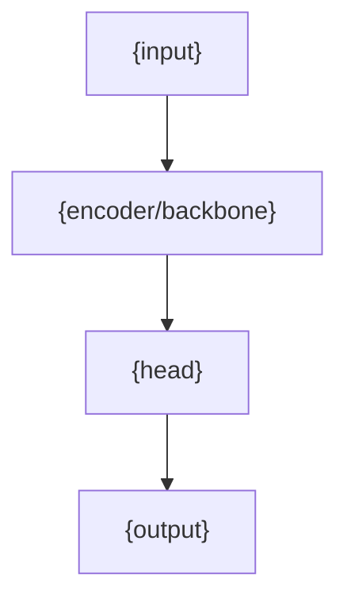

# {name}

## Overview

<!-- @agent: 3 sentences max: what this model predicts, classifies, or generates, where it is used, what breaks without it. Define acronyms on first use. -->

## Requirements

### Functional

<!-- @agent: Expected behavior for the consumer. What the model must produce: output shape, supported inputs, task/class coverage, confidence/score semantics. Phrase as "must", "returns", "accepts". -->

- {requirement}

### Non-Functional

<!-- @agent: Constraints on how it behaves — latency, throughput, memory, cost, accuracy targets, hardware. Numbers, not vibes. -->

- {requirement}

## Design

### Model Inputs

<!-- @agent: The inputs the model accepts — modalities, shapes, preprocessing. Name the concrete input types. -->

### Model Outputs

<!-- @agent: The outputs the model returns — shapes, label/task space, score semantics. -->

### Architecture

<!-- @agent: graph TD/LR of the network or pipeline the model uses. Required — always a diagram, never ASCII art. -->



### Training & Evaluation

<!-- @agent: How the model is trained and evaluated — data, loss, metric, eval setup. High level; lower-level detail goes in ## Implementation. -->

### API

<!-- @agent: [public-api] Which module to import, and how to train and infer with the model. Runnable code. This is the ONLY surface cross-module docs may reference. -->

```python
from {package} import {Model}

model = {Model}.load("{artifact}")
pred = model.predict({example})   # {Type}
```

## Implementation

### {Section Heading, Repeats}

<!-- @agent: Lower-level detail that does not fit tersely in Design — activation function choices, the dataset used, deviations from standard training methodology, and internal invariants (e.g. "the encoder caches tokens and must be thread-safe"). One subsection per topic. Invariants are NOT expected behavior — keep them out of Functional. -->

## References

<!-- @agent: Technical/external references actually used — model paper/architecture, dataset, upstream framework docs, weights artifact source. Real verified sources. -->

- [{Reference}]({url}) — {why}
