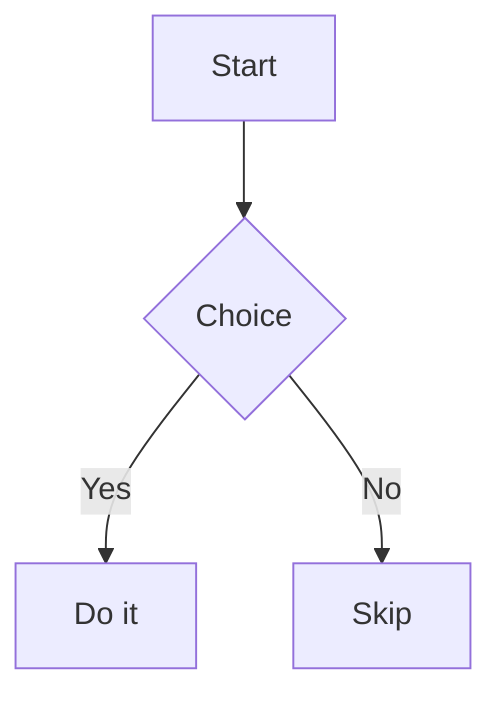

# diffbook components — an operational cheat-sheet

ed authors interactive textbooks as **diffbook MDX**. This file maps *pedagogical intent* to the correct diffbook component, gives the **exact syntax** (copied from the diffbook `author` workflow — the source of truth), and states the file-extension, frontmatter, LaTeX, and invocation rules. `create-lesson`, `create-quiz`, `create-project`, and the `ed-lesson-author` agent read this before writing any `.mdx`.

**Ground rules (memorize these):**

- **All twelve components are auto-available in any `.mdx` file — no import needed.** They are the components diffbook exports: `Bookmark`, `Chart`, `Figure`, `Manim`, `Mermaid`, `MultipleChoiceQuestion`, `Notice`, `NumericQuestion`, `QA`, `Quiz`, `SingleChoiceQuestion`, `YouTube`.
- **Use `.mdx` for any page that uses a component tag; use `.md` for prose-only pages** (e.g. a module's `references.md`).
- **Mermaid is a fenced ` ```mermaid ` code block, NOT a `<Mermaid>` tag.** A rehype plugin rewrites the fenced block into the component automatically. Never write `<Mermaid>` in a page.
- **`<Card>` is a layout/slot component, not content** — never place it in page body.
- **LaTeX uses `\( … \)` (inline) and `\[ … \]` (display). Never `$…$`.**
- **Prose is soft-wrapped** (one line per paragraph; see `pedagogy.md` §10).

---

## Which component for which teaching moment

| Teaching moment | Component |
|---|---|
| Self-check / Feynman retrieval check (hide the answer) | `QA` |
| Module review / scored questionnaire | `Quiz` |
| One standalone graded question (single answer) | `SingleChoiceQuestion` |
| One standalone graded question (multiple answers) | `MultipleChoiceQuestion` |
| One standalone graded numeric answer | `NumericQuestion` |
| Math intuition that is *dynamic* (a vector rotating, a distribution shifting, gradient descent stepping) | `Manim` |
| Architecture / pipeline / flow / state machine / dependency structure | mermaid fenced block |
| Quantitative comparison / trend / distribution | `Chart` |
| Featured verified reference (rich link card) | `Bookmark` |
| A specific lecture from a named course playlist | `YouTube` |
| Captioned image / static diagram you already have as an asset | `Figure` |
| Caveat, warning, "in practice…", or important note | `Notice` |

Match the modality to the concept's *character* (Mayer's multimedia principles; see `pedagogy.md` §3), then use the interactive realization. Every visual must earn its place (§3) — do not reach for a component to decorate.

---

## Exact component syntax

### Notice — callout / warning / caveat

`variant`: `"info"` (default) `| "success" | "warning" | "error" | "none"`. Optional `title`. Body is MDX prose.

```mdx
<Notice variant="warning" title="Heads up">
  Body content goes here.
</Notice>
```

### QA — hidden self-check (Feynman retrieval)

Native `<details>`/`<summary>`; works with zero JS. `question` (required); children are the answer body. Use to hide every self-check answer so the reader attempts retrieval first (`pedagogy.md` §4, §9).

```mdx
<QA question="Why does scaled dot-product attention divide by the square root of the key dimension?">
  Without the \( \sqrt{d_k} \) scaling, dot products grow with dimension, pushing softmax into low-entropy regions where gradients vanish.
</QA>
```

### Figure — captioned image

`src` (required), `alt` (required), optional `caption`, `credit`. Reference an asset by bare filename after dropping it in an asset dir (below).

```mdx
<Figure src="diagram.png" alt="System architecture" caption="High-level data flow" credit="Jane Doe" />
```

### Bookmark — verified reference link card

`url` (required). Renders a rich Open Graph card fetched at build time. Use to feature a *verified* source (`source-tiers.md`).

```mdx
<Bookmark url="https://ocw.mit.edu/courses/6-036-introduction-to-machine-learning-fall-2020/" />
```

### YouTube — lecture embed

`id` (required — video ID or full URL), optional `title`, `description`, `chapters` (array of `{ t, label }`, `t` in seconds), `poster`.

```mdx
<YouTube
  id="dQw4w9WgXcQ"
  title="Lecture 5 — Attention"
  chapters={[
    { t: 0, label: 'Overview' },
    { t: 90, label: 'Scaled dot-product' },
  ]}
/>
```

### Chart — data chart (Recharts)

`type` (required): `"line" | "bar" | "area" | "pie"`. `data` (required, JSON-serializable rows). `series` (required, `{ key, label?, color? }[]`). Optional `xKey`, `nameKey`, `height` (default 320), `showLegend`, `showGrid`, `showAxis`. Props must be JSON-serializable.

```mdx
<Chart
  type="bar"
  xKey="month"
  data={[
    { month: 'Jan', users: 120 },
    { month: 'Feb', users: 210 },
  ]}
  series={[{ key: 'users', label: 'Active users' }]}
/>
```

### Mermaid — fenced block (NOT a tag)

Author diagrams as a fenced ` ```mermaid ` block. Never write `<Mermaid>`.

````markdown

````

### Manim — math animation

`scene` (required — scene-script basename, no extension), optional `width` (default 800), `height` (default 450), `caption`. The scene script lives in an asset dir as a `*.{ts,js}` file exporting a default async function that receives a `Scene`; Manim scene scripts resolve from `<docsDir>/_animations/` (i.e. `{BOOK_DIR}/docs/_animations/`). Use for *dynamic* math intuition.

```mdx
<Manim scene="sine_wave" caption="A sine wave being drawn" />
```

### SingleChoiceQuestion — one graded single-answer item

`id` (required, unique per page — persists the answer), `prompt` (required), `choices` (required, `string[]`), `correct` (required, zero-based index), optional `explanation`.

```mdx
<SingleChoiceQuestion
  id="q-color-space"
  prompt="Which normalization removes batch-size dependence?"
  choices={['Batch norm', 'Layer norm', 'Weight decay']}
  correct={1}
  explanation="Layer norm normalizes over features per example, so it does not depend on batch statistics."
/>
```

### MultipleChoiceQuestion — one graded multi-answer item

`id` (required), `prompt` (required), `choices` (required), `correct` (required, `number[]` of all correct indices), optional `explanation`. Graded by set equality.

```mdx
<MultipleChoiceQuestion
  id="q-attn-factors"
  prompt="Select ALL factors that let a transformer extrapolate to longer sequences."
  choices={['Relative position encodings', 'Larger batch size', 'ALiBi biases', 'More attention heads']}
  correct={[0, 2]}
  explanation="Relative/ALiBi position schemes generalize across lengths; batch size and head count do not directly affect length extrapolation."
/>
```

### NumericQuestion — one graded numeric item

`id` (required), `prompt` (required), `answer` (required, number), optional `tolerance` (default 0), `unit`, `explanation`.

```mdx
<NumericQuestion
  id="q-gd-step"
  prompt="After one gradient step with η=0.1 on the logistic loss (w=0.5, x=2, y=1), what is w? (2 dp)"
  answer={0.52}
  tolerance={0.01}
  unit=""
  explanation="w ← w − η·(σ(wx)−y)·x."
/>
```

### Quiz — grouped, scored questionnaire

`id` (required, unique per page), optional `title`, `questions` (required). Each question is a discriminated union by `type`, JSON-serializable:

- `{ id, type: 'single', prompt, choices: string[], correct: number, explanation? }`
- `{ id, type: 'multiple', prompt, choices: string[], correct: number[], explanation? }`
- `{ id, type: 'numeric', prompt, answer: number, tolerance?, unit?, explanation? }`

`create-quiz` uses this for module review with a Bloom-calibrated mix (`blooms-taxonomy.md`).

```mdx
<Quiz
  id="m5-quiz"
  title="Module 5 review — Attention and Transformers"
  questions={[
    {
      id: 'q1',
      type: 'single',
      prompt: 'What does the softmax temperature control?',
      choices: ['Learning rate', 'Distribution sharpness', 'Sequence length'],
      correct: 1,
      explanation: 'Lower temperature sharpens the distribution; higher flattens it.',
    },
    {
      id: 'q2',
      type: 'multiple',
      prompt: 'Which are components of scaled dot-product attention?',
      choices: ['Query', 'Momentum', 'Key', 'Value'],
      correct: [0, 2, 3],
    },
    { id: 'q3', type: 'numeric', prompt: 'Scaling divides by sqrt of d_k; if d_k=64, the divisor is?', answer: 8, tolerance: 0 },
  ]}
/>
```

---

## Page mechanics

### Extension rule

- **`.mdx`** — any page that uses one or more of the twelve component tags (all lessons, quizzes, and projects will).
- **`.md`** — prose-only pages (a module's `references.md`, a plain landing page with no components).

### No imports

Never add `import` statements for the twelve components — they are globally available in `.mdx`. Adding imports is an error.

### Frontmatter

Per-page YAML frontmatter; all keys optional. diffbook mirrors the folder structure into routes and orders the sidebar by `order`.

```markdown
---
title: Attention and Transformers
order: 5
description: Scaled dot-product attention, multi-head attention, and the transformer block.
author: ed
date: 2026-07-18
label: Custom Sidebar Label
hidden: false
draft: false
cover: cover.png
slug: attention
---
```

| Key | Purpose |
|---|---|
| `title` | Page title (falls back to first `# heading`). |
| `order` | Sidebar/nav sort position. Module dir `NN` and lesson `MM` map to `order`. |
| `description` | `<meta name="description">`. |
| `author`, `date` | Attribution. |
| `label` | Override chapter group label (on a directory's `index.md`). |
| `hidden` | Hide from sidebar. |
| `draft` | Exclude from build entirely. |
| `cover`, `slug` | Cover image; URL-slug override. |

### LaTeX

Inline `\( … \)`, display `\[ … \]`. Never `$…$` or `$$…$$`.

### Assets (Figure images, Manim scene scripts)

Drop images and Manim scene scripts (`*.{ts,js}`) in one of the asset dirs — `.diffbook/assets/`, `.diffbook/public/`, or `<docsRoot>/.assets/` — then reference by **bare filename** (`Figure src="diagram.png"`) or **basename without extension** (`Manim scene="sine_wave"`). Manim scene scripts also resolve from `<docsDir>/_animations/` (`{BOOK_DIR}/docs/_animations/`); a scene script exports a default async function that receives a `Scene`.

---

## Scaffolding and authoring via the `/diffbook` skill

ed does not reimplement diffbook. It calls the diffbook skill.

- **`/diffbook init`** — scaffolds the diffbook project (the `astro.config.mjs`, the `docs/` root, asset dirs). `autodidact` runs this once to create the book before authoring any pages.
- **`/diffbook author`** — places and **validates** component pages: checks that every tag is one of the twelve, that required props are present (e.g. `SingleChoiceQuestion` needs `id`, `prompt`, `choices`, `correct`), and that component-heavy pages use `.mdx`. `create-lesson` SHOULD call `/diffbook author` to validate component-heavy pages, but may also write MDX directly following this cheat-sheet.
- Preview locally with `npx diffbook dev`.

### Validation checklist (run before publishing any page)

1. Every component tag is one of the twelve (Mermaid via fenced block; never `<Mermaid>` or `<Card>` in content).
2. Required props present for every question/component.
3. Component-heavy pages use `.mdx`; prose-only pages use `.md`.
4. No `import` statements for the twelve components.
5. LaTeX uses `\( \)` / `\[ \]`, never `$`.
6. Assets referenced by bare filename/basename and present in an asset dir.
