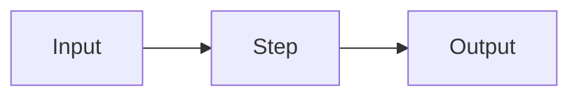

{/*
  ed lesson skeleton — diffbook MDX. Components are auto-available (no imports).
  Rules (see references/pedagogy.md + quality-gates.md):
    - DEFINE-BEFORE-DISPLAY: define every term in prose before any diagram/code/table/component uses it.
    - RHYTHM: no more than 3 pure-prose paragraphs without a non-text element; vary element types.
    - >=1 interactive element per major concept; every visual must earn its place (no decoration).
    - Graduate level: full jargon after first definition; LaTeX in \( \) and \[ \], never $...$.
    - End with a check (<QA> or <Quiz>). >=4 verified references at the bottom.
    - Soft-wrap: one line per paragraph.
*/}

## Intro hook

<Open with a concrete question or scenario that motivates the lesson — why this matters, what breaks without it. One or two soft-wrapped paragraphs. No jargon before it is defined.>

## <First major concept>

<Define the concept in prose FIRST. Introduce notation with \( \) inline math, e.g. the attention score \( s_{ij} = q_i \cdot k_j \). Only after the prose definition, show a reinforcing element.>

{/* Signpost sentence before a complex element, then the element: */}

The diagram below shows how the components connect once each term above is defined.



<QA question="<a self-check question on this concept>">
<The hidden answer — 2–4 sentences reinforcing the definition.>
</QA>

## <Second major concept>

<Prose definition first. Progressive disclosure: intuition → minimal formalism → full detail.>

\[
  <display equation, e.g. \mathrm{Attention}(Q,K,V) = \mathrm{softmax}\!\left(\frac{QK^\top}{\sqrt{d_k}}\right)V>
\]

{/* A worked, runnable example grounds the formalism: */}

```python
# minimal, correct, runnable illustration of the concept
import torch, torch.nn.functional as F
def attention(q, k, v):
    scores = q @ k.transpose(-2, -1) / (k.size(-1) ** 0.5)
    return F.softmax(scores, dim=-1) @ v
```

{/* Use a math animation when motion/derivation aids intuition (scene lives in {BOOK_DIR}/_animations/): */}
<Manim scene="<scene_name>" caption="<what the animation shows>" />

## <Third major concept / application>

<Prose. Then reinforce with data or a lecture segment as appropriate.>

<Chart type="bar" xKey="<x>" data={[{ /* … */ }]} series={[{ key: "<k>", label: "<label>" }]} />

<YouTube id="<video_id>" title="<lecture title>" chapters={[{ t: 0, label: "Overview" }]} />

{/* A captioned image (asset in an asset dir) when a real figure clarifies: */}
<Figure src="<diagram.png>" alt="<what it shows>" caption="<caption>" credit="<source>" />

## Summary and check

<Two or three sentences recapping the through-line of the lesson.>

<Quiz
  id="<NN-MM>-check"
  title="Quick check"
  questions={[
    {
      id: "c1",
      type: "single",
      prompt: "<a synthesis question over the lesson>",
      choices: ["<A>", "<B>", "<C>", "<D>"],
      correct: 0,
      explanation: "<50–100 words: why the key is right and why the top distractor is wrong>",
    },
  ]}
/>

## References

{/* >=4 verified sources. Use <Bookmark> for URLs (WebFetch-verified); cite textbooks fully without fragile URLs. */}

<Bookmark url="https://<verified-url>" />
<Bookmark url="https://<verified-url>" />

- <Author(s)>, *<Textbook Title>*, <Publisher>, <edition/year>, ch. <n> — <what it grounds>.
- <Author(s)>, "<Paper Title>", <venue>, <year> — <what it grounds>.
