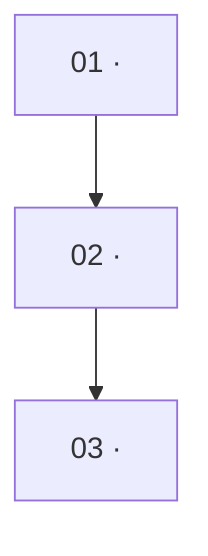

# <Course Title> — Syllabus

## Course Overview

<One to two soft-wrapped paragraphs: what the course covers, the graduate bar it targets, and the arc from foundations to advanced material. State the assumed prior knowledge from the brief.>

**Prior knowledge assumed:** <from brief.prior_knowledge>

**Target outcomes (from brief):**

- <outcome 1>
- <outcome 2>
- <outcome 3>

## Module Dependency

| Module | Depends on | Bloom emphasis |
|--------|-----------|----------------|
| 01 · <title> | — (foundational) | Remember / Understand |
| 02 · <title> | 01 | Understand / Apply |
| 03 · <title> | 01, 02 | Apply / Analyze |

> Foundational (zero-prerequisite) modules must read as genuinely introductory — see the smell test in `quality-gates.md`.

---

## Module 01 — <Module Title>

**Goal:** <one sentence: what this module accomplishes>

**Expected Outcome:** <concrete, assessable — what the learner can do after this module>

**Learning Objectives** (Bloom-tagged):

- (Remember) <verb-led objective>
- (Understand) <verb-led objective>
- (Apply) <verb-led objective>

**Concepts Covered:** <comma-separated concept list>

**Prerequisites:** — (foundational)

**Primary Text Sources** (from `explore/sources.md`):

- <Source title / citation> — <why it grounds this module, 1 line>
- <Source title / citation> — <…>

**Mini-Project idea:** <a small, buildable task that exercises this module's core skill>

---

## Module 02 — <Module Title>

**Goal:** <…>

**Expected Outcome:** <…>

**Learning Objectives** (Bloom-tagged):

- (Understand) <…>
- (Apply) <…>
- (Analyze) <…>

**Concepts Covered:** <…>

**Prerequisites:** [Module 01](#module-01--module-title)

**Primary Text Sources:**

- <…>

**Mini-Project idea:** <…>

---

<!-- Repeat one "## Module NN — Title" section per module, in strict dependency order. -->

## References

Full annotated source catalog: `.codevoyant/ed/<course-slug>/explore/sources.md`. Per-module shortlists: `.codevoyant/ed/<course-slug>/explore/modules/<NN-slug>.md`.
